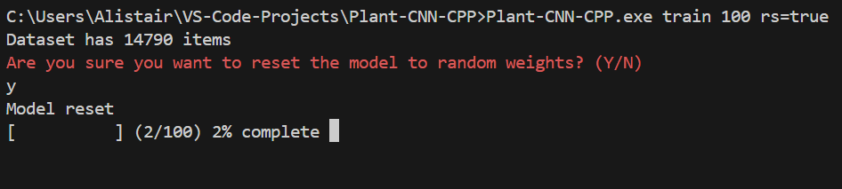
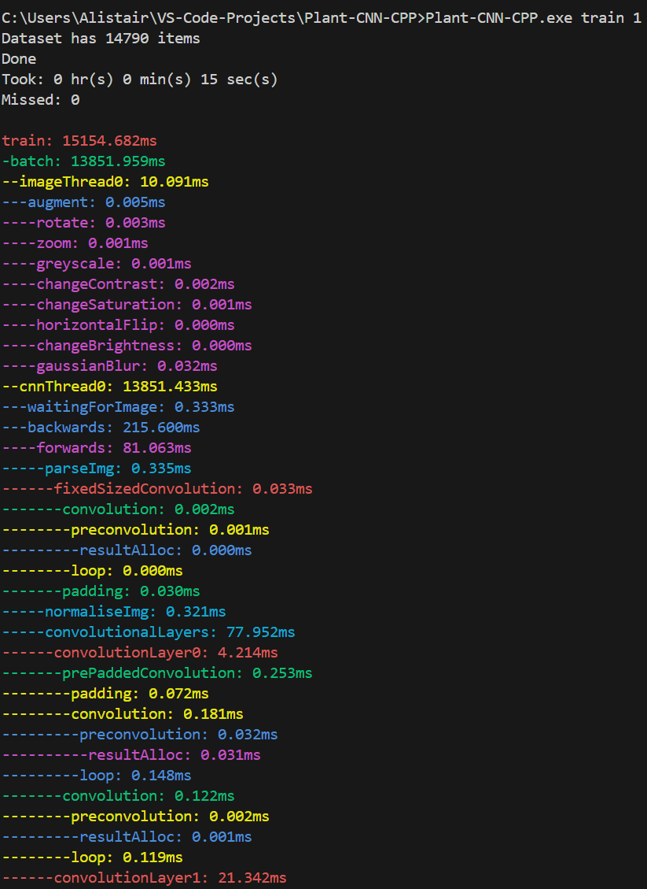

# Plant-CNN-CPP

Convolutional neural network written from first principles. This is the development of [Plant-CNN](https://github.com/Alistair58/Plant-CNN); it has more features and runs faster.

### How to Run

This project only uses header libraries and so can be compiled and ran with only CMake and g++.

The CNN utilises AVX2 intrinsics and so compatibility is restricted to x86 CPUs that support this.

### Photos

